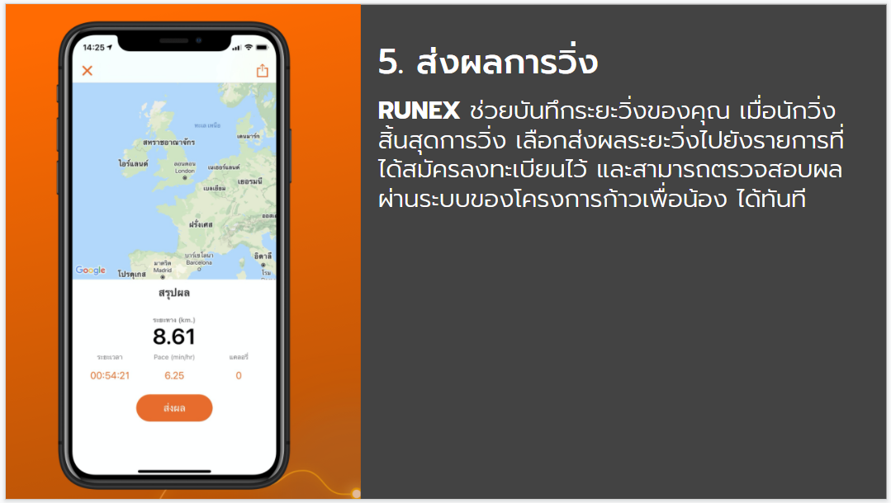
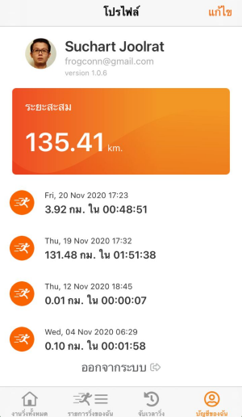

# RUNEX 
> ขอเป็นอีกหนึ่งช่องทางที่ช่วย ให้นักวิ่งสามารถ วิ่งเพื่อสะสมระยะและส่งผลไปยัง รายการวิ่งในโครงการ "ก้าวเพื่อน้อง" ได้สะดวกยิ่งขึ้น เพียงแค่ทำตามขั้นตอน ง่ายๆ 5 ขั้นตอน ดังนี้

## 1. ติดตั้ง Application RUNEX

## 2. เข้าใช้งาน

## 3. เลือกรายการวิ่ง

## ยืนยันการสมัครด้วย E-BIB

## 4. เริ่มวิ่งเพื่อสะสมระยะ

## 5. ส่งผลการวิ่ง

## คุณสมบัติเพิ่มเติม

## การส่งผลเมื่อวิ่งเสร็จ

นักวิ่งสามารถกดส่งผลจากแอปพลิเคชัน RUNEX ได้ทันทีเมื่อหยุดการจับเวลาวิ่ง

แอปพลิเคชัน RUNEX จะถามยืนยันว่าต้องการสิ้นสุดการวิ่งหรือไม่ ตามภาพตัวอย่างด้านล่าง

หากกดปุ่มยืนยัน แอปพลิเคชัน RUNEX จะแสดงหน้าจอสรุปผลและจะแสดงปุ่มส่งผล  โดยที่นักวิ่งสามารถกดปุ่มส่งผลได้ทันที่
> ปุ่มส่งผลนี้จำเป็นต้องเชื่อมต่อ Internet บนสมาร์ทโฟนให้เรียบร้อยก่อน

แอปพลิเคชัน RUNEX จะแสดงหน้าจอเพื่อให้เลือกรายการที่ได้สมัครไว้ และต้องการส่งผล ซึ่งเมื่อเลือกรายการแล้วให้กดปุ่ม ยืนยันการส่งผลอีกครั้ง ดังตัวอย่างในภาพด้านล่าง

เมื่อส่งผลได้สำเร็จจะแสดงหน้าจอ ตามตัวอย่างด้านล่าง ให้กดปุ่มจบการส่งผล เพื่อกลับไปยังหน้าจอหลักของแอปพลิเคชัน RUNEX

## การส่งผลย้อนหลัง
> ในบางครั้งนักวิ่งอาจจะไม่สามารถเข้าถึง Internet ได้ตลอดเวลา แอปพลิเคชัน RUNEX จะช่วยเก็บระยะวิ่งไว้ให้ โดยสามารถเลือกกลับมาส่งผลระยะสะสมวิ่งได้อีกครั้งเมื่อสมาร์ทโฟนสามารถเข้าถึง Internet ได้ โดยที่การส่งผลนั้นจะสามารถส่งได้เพียงครั้งเดียว และจะไม่สามารารถส่งผลการวิ่งที่นักวิ่งได้สะสมไว้ก่อนหรือหลังระยะเวลาที่รายการได้กำหนดไว้

### 1. เข้าแอปพลิชัน Runex
> ให้นักวิ่งเชื่อมต่อ Internet บนสมาร์ทโฟน และไปที่เมนู บัญชีของฉัน จะพบหน้าจอดังภาพด้านล่าง

### 2. เลือกระยะวิ่งที่สะสมไว้ และเลือกส่งผล
> นักวิ่งสามารถเลือกการส่งได้ตามตัวอย่างจากรูปภาพด้านล่าง ใน 2 ขึ้นตอนดังนี้

#### 2.1 เลือกระยะที่สะสมที่บันทึกไว้

#### 2.2 ส่งผลการวิ่งไปยังรายการที่ได้สมัครไว้
> เมื่อเลือกระยะสะสมได้แล้วแอปพลิเคชัน RUNEX จะแสดงหน้าจอระยะการวิ่ง และจะแสดงปุ่มส่งผล ดังตัวอย่างภาพด้านล่าง

> แอปพลิเคชัน RUNEX จะแสดงหน้าจอเพื่อให้เลือกรายการที่ได้สมัครไว้ และต้องการส่งผล ซึ่งเมื่อเลือกรายการแล้วให้กดปุ่ม ยืนยันการส่งผลอีกครั้ง ดังตัวอย่างในภาพด้านล่าง

เมื่อส่งผลได้สำเร็จจะแสดงหน้าจอ ตามตัวอย่างด้านล่าง ให้กดปุ่มจบการส่งผล เพื่อกลับไปยังหน้าจอหลักของแอปพลิเคชัน RUNEX

## การตรวจสอบผล
หลังจากนักวิ่งได้สะสมระยะวิ่งและส่งผลด้วยแอปพลิเคชัน RUNEX เรียบร้อยแล้ว นักวิ่งสามารถตรวจสอบผลของการส่งระยะสะสมด้วยการเข้าเว็บไซต์ ก้าวคนละก้าว โดยการใช้เว็บเบราเซอร์ที่ใช้ประจำ ทั้งเครื่องคอมพิวเตอร์หรือสมาร์ทโฟน หรือคลิกตามลิงค์ด้านล่าง
> https://kaokonlakao.com

จากนั้นให้คลิกที่เมนู อันดับนักวิ่ง ตามภาพด่านล่างนี้

จากนั้นระบบจะพานักวิ่งไปยังลิงค์หน้าจัดอันดับนักวิ่ง คือ
> https://kaokonlakao.com/vr_submissions/participants/leaderboard

และนักวิ่งจะสามารถเห็นอันดับ (Ranking), ระยะสะสม (Total) และเวลาสะสมที่ใช้วิ่งทั้งหมด (Total time) ตามตัวอย่างภาพด้านล่าง

จากนั้นนักวิ่งจะพบกลับหน้าจอที่แสดงรายละเอียดสรุปการวิ่งของนักวิ่งเอง และจะมีเมนูเพื่อตรวจสอบผลวิ่ง ดังตัวอย่างในรูปด้านล่างนี้

และนักวิ่งจะเห็นประวัติการส่งผลวิ่งจากแอปพลิเคชัน RUNEX ซึ่งประกอบด้วยรูปภาพแผนที่ในการวิ่ง ระยะทาง สถานะการอนุมัติ และวันเวลาที่ส่งผล ตามตัวอย่างดังภาพด้านล่างนี้

> เมื่อถึงขั้นตอนนี้นั้นหมายถึงนักวิ่งได้วิ่งสะสมระยะได้ครบถ้วนแล้ว 
