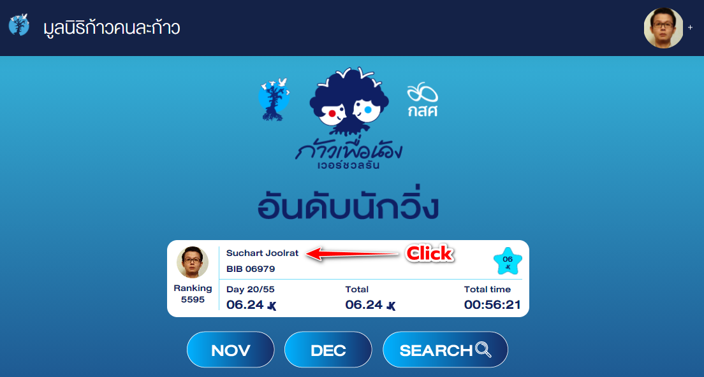

## การตรวจสอบผล
หลังจากนักวิ่งได้สะสมระยะวิ่งและส่งผลด้วยแอปพลิเคชัน RUNEX เรียบร้อยแล้ว นักวิ่งสามารถตรวจสอบผลของการส่งระยะสะสมด้วยการเข้าเว็บไซต์ ก้าวคนละก้าว โดยการใช้เว็บเบราเซอร์ที่ใช้ประจำ ทั้งเครื่องคอมพิวเตอร์หรือสมาร์ทโฟน หรือคลิกตามลิงค์ด้านล่าง
> https://kaokonlakao.com

จากนั้นให้คลิกที่เมนู อันดับนักวิ่ง ตามภาพด่านล่างนี้

จากนั้นระบบจะพานักวิ่งไปยังลิงค์หน้าจัดอันดับนักวิ่ง คือ
> https://kaokonlakao.com/vr_submissions/participants/leaderboard

และนักวิ่งจะสามารถเห็นอันดับ (Ranking), ระยะสะสม (Total) และเวลาสะสมที่ใช้วิ่งทั้งหมด (Total time) ตามตัวอย่างภาพด้านล่าง

จากนั้นนักวิ่งจะพบกลับหน้าจอที่แสดงรายละเอียดสรุปการวิ่งของนักวิ่งเอง และจะมีเมนูเพื่อตรวจสอบผลวิ่ง ดังตัวอย่างในรูปด้านล่างนี้

และนักวิ่งจะเห็นประวัติการส่งผลวิ่งจากแอปพลิเคชัน RUNEX ซึ่งประกอบด้วยรูปภาพแผนที่ในการวิ่ง ระยะทาง สถานะการอนุมัติ และวันเวลาที่ส่งผล ตามตัวอย่างดังภาพด้านล่างนี้

