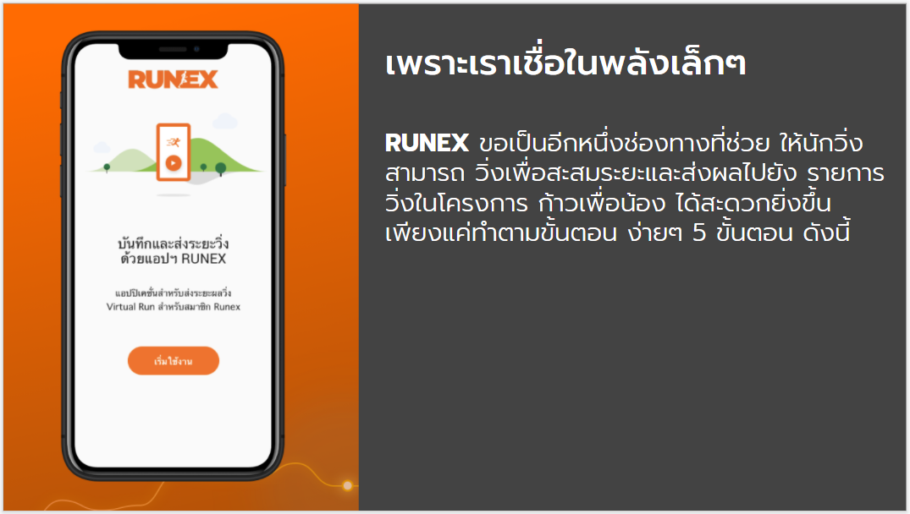
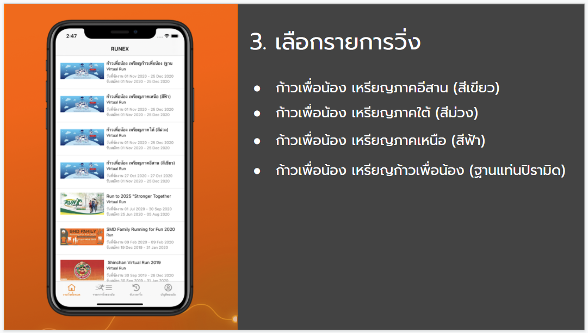
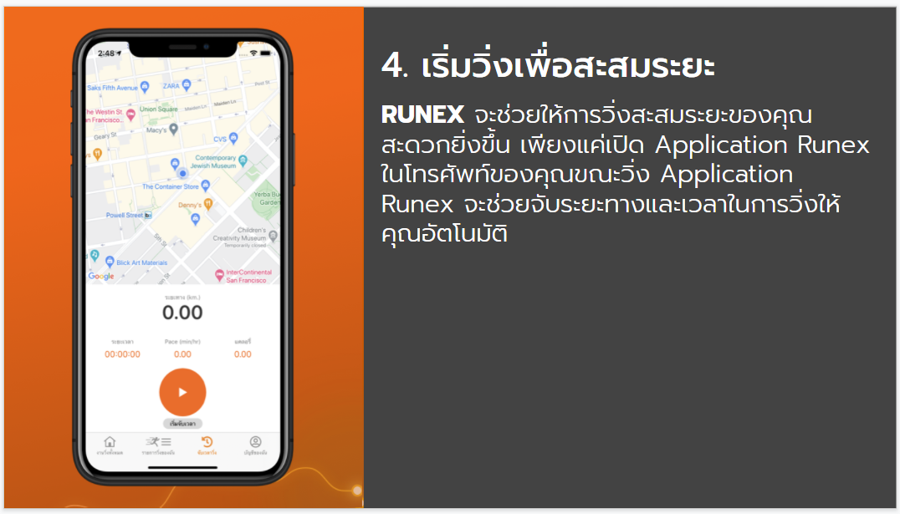
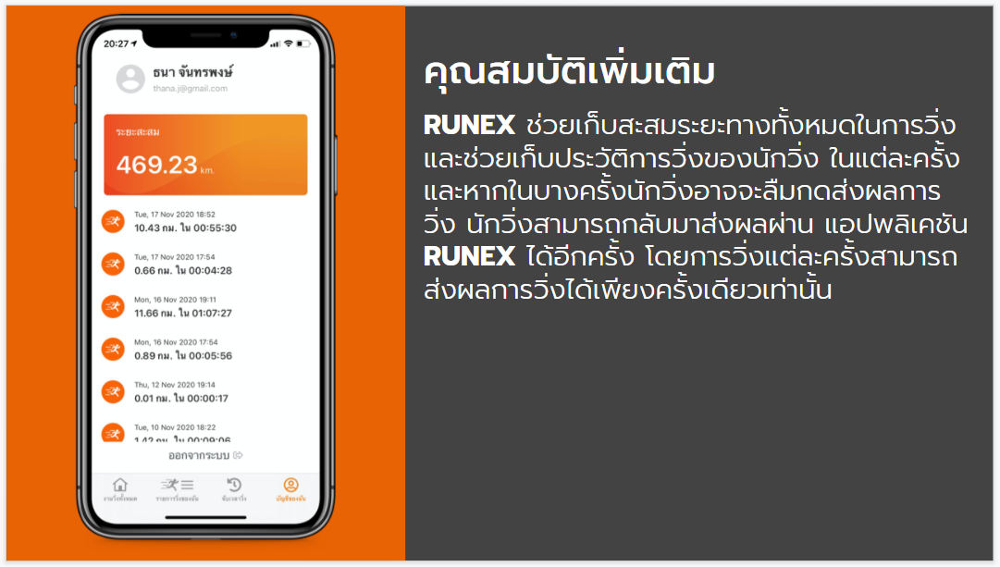

# RUNEX 
> ขอเป็นอีกหนึ่งช่องทางที่ช่วย ให้นักวิ่งสามารถ วิ่งเพื่อสะสมระยะและส่งผลไปยัง รายการวิ่งในโครงการ ก้าวเพื่อน้อง ได้สะดวกยิ่งขึ้น เพียงแค่ทำตามขั้นตอน ง่ายๆ 5 ขั้นตอน ดังนี้

## 1. ติดตั้ง Application RUNEX

## 2. เข้าใช้งาน

## 3. เลือกรายการวิ่ง

## ยืนยันการสมัครด้วย E-BIB

## 4. เริ่มวิ่งเพื่อสะสมระยะ

## 5. ส่งผลการวิ่ง

## คุณสมบัติเพิ่มเติม

